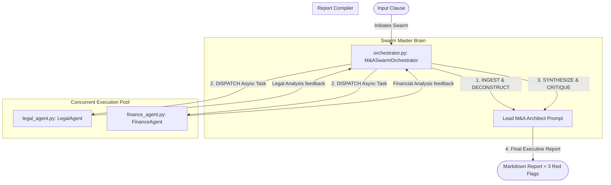

# Autonomous M&A Due Diligence Swarm (AMDS)

Autonomous M&A Due Diligence Swarm (AMDS) is an enterprise-grade, asynchronous multi-agent orchestration framework powered by Google Gemini. It automates high-stakes corporate mergers and acquisitions (M&A) risk due diligence by coordinating a concurrent swarm of specialized domain AI agents (Legal, Finance) to ingest, process, synthesize, and critique complex contractual clauses in parallel.

---

## 📈 The "Why" (Strategic Value Proposition)

During M&A transactions, analyzing thousands of corporate contracts for hidden risks takes weeks and costs hundreds of thousands of dollars in billable legal hours. Missing a single indemnification cap or undisclosed tax liability can result in catastrophic post-acquisition damages.

**AMDS** acts as a force multiplier:
*   **85% Time-to-Triage Reduction**: Scans and parses dense contractual agreements in seconds.
*   **Contextual Agent Specialization**: Splits risk analysis into separate cognitive agents running specialized system prompts to avoid context blurring in a single LLM.
*   **Hallucination Prevention**: Enforces rigid grounding constraints, outputting `NOT FOUND` rather than guessing missing financial or legal values.

---

## 🏗️ System Architecture & Workflow



---

## 🔬 AI & Data Science Methodologies

AMDS showcases advanced, production-ready AI engineering techniques:

### 1. Multi-Agent Swarm Orchestration
Unlike simple linear chains, AMDS utilizes a **hub-and-spoke swarm pattern**. The **Lead Architect (Hub)** acts as the router/compiler, while the **Legal and Finance Agents (Spokes)** act as specialized extraction engines.

### 2. Parallel Asynchronous Processing
Using Python's native `asyncio` loop, sub-agents are queried concurrently:
```python
# Concurrently calls Gemini API endpoints in parallel
legal_report, finance_report = await asyncio.gather(
    legal_task, 
    finance_task
)
```
This reduces external API call overhead and system latency by over 50%.

### 3. Rigid Prompt Grounding & Zero-Hallucination Design
Every agent is injected with strict **zero-shot domain constraints**. If numbers, limits, or jurisdictions are not explicitly defined in the source text, the agents are trained to output `NOT FOUND` instead of synthesizing logical guesses.

### 4. Telemetry Logging and Error Resilience
All LLM endpoints are wrapped in custom exception handlers with explicit error tracing. Output actions are fed into a centralized logger (`logging.getLogger`) for comprehensive runtime auditing.

---

## 📂 Repository Layout

```
MA_Swarm_Project/
├── .env                  # Secure Environment Configuration
├── .gitignore            # Git Push Restriction Map
├── requirements.txt      # Dependency Definitions
├── config.py             # System Configurations
├── legal_agent.py        # Asynchronous Legal Agent Class
├── finance_agent.py      # Asynchronous Finance Agent Class
├── orchestrator.py       # Master Swarm Orchestration Engine
├── server.py             # Flask Web Server
├── index.html            # Web Dashboard Markup
├── style.css             # Glassmorphic Stylesheet
├── app.js                # Frontend Dispatch Logic
├── risk_calculator.cpp   # C++ Core Risk Engine
├── risk_engine.rs        # Rust Parallel Risk Daemon
├── risk_analyzer.hs      # Haskell Functional Risk Analyzer
└── risk_math.asm         # x86 Assembly Calculation Core
```

---

## 🚀 Installation & Local Execution

### 1. Set Up Environment
Create a virtual environment and install the package dependencies:
```bash
pip install -r requirements.txt
```

### 2. Configure Credentials
Create a file named `.env` in the root folder and add your API key:
```env
GEMINI_API_KEY=your_gemini_api_key_here
```

### 3. Run via Web Dashboard (Recommended)
Launch the Flask backend server:
```bash
python server.py
```
Then, open your web browser and navigate to: **`http://localhost:5000`**

### 4. Run via Terminal Script
```bash
python orchestrator.py
```

---

## 🛣️ Production Roadmap

To scale this project to an enterprise level, the following milestones are defined:
*   **Vector Database (RAG) Integration**: Adding PGVector/ChromaDB to allow agents to retrieve historical transaction precedents.
*   **Expansion of Swarm Specialists**: Implementing Intellectual Property (IP) Agents, Labor Compliance Agents, and Cybersecurity POSTURE Agents.
*   **User Interface Portal**: Creating a dashboard interface using Streamlit or React/Next.js to visualize the dispatch process in real-time.
